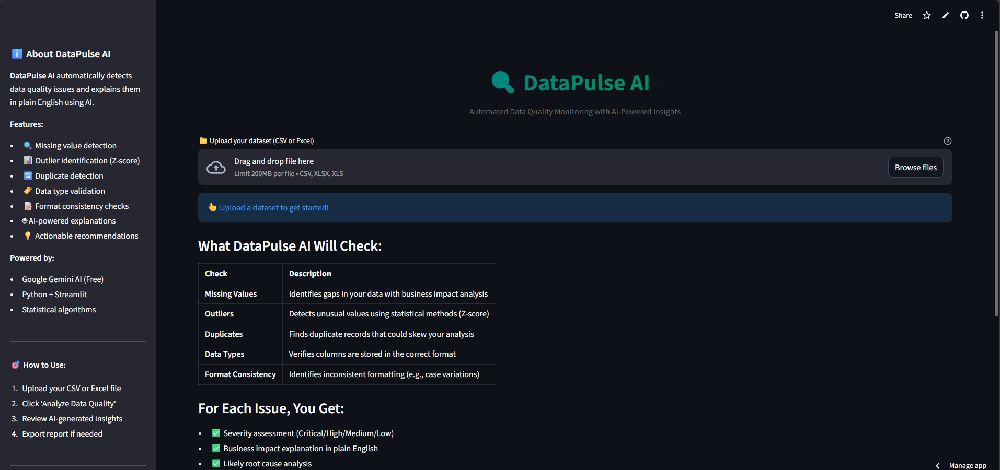

# 🔍 DataPulse AI / 💬 InsightBot

AI-powered data analysis tool built with Google Gemini and Streamlit.

## 🎯 Overview

[Brief description of what it does]

## ✨ Features

- 🔍 Missing value detection
- 📊 Outlier identification (Z-score)
- 🔄 Duplicate detection
- 🏷️ Data type validation
- 📝 Format consistency checks
- 🤖 AI-powered explanations
- 💡 Actionable recommendations

## 🚀 Live Demo

datapulse-ai.streamlit.app

## 🛠️ Tech Stack

- **AI**: Google Gemini 2.0 
- **Frontend**: Streamlit 1.40+
- **Analysis**: Pandas, NumPy, SciPy
- **Visualization**: Plotly
- **Deployment**: Streamlit Cloud

## 💰 Cost

**$0** - Built entirely with free tools!

## 🏃 Quick Start
```bash
# Clone repo
git clone https://github.com/bhandarytejas/DataPulse-AI.git
cd DataPulse-AI

# Install dependencies
pip install -r requirements.txt

# Add API key
# Create .streamlit/secrets.toml with:
# GEMINI_API_KEY = "your-key"

# Run locally
streamlit run app.py
```

## 📸 Screenshots



## 🎓 What I Learned

- LLM integration with production APIs
- Prompt engineering for consistent outputs
- Full-stack deployment workflows


## 👤 Author

**Your Name**
- GitHub: [@bhandarytejas](https://github.com/bhandarytejas)
- LinkedIn: [bhandaritejas](https://www.linkedin.com/in/bhandaritejas/)